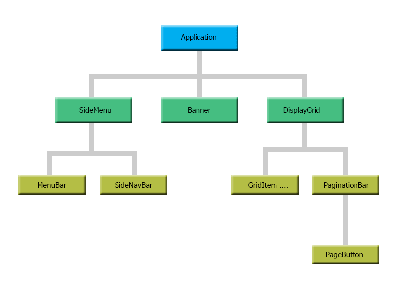

# ReactJS : Building Simple Responsive Frontend Application using ReactJS
This project is to demonstrate how to create a simple ReactJS front application using data provided by WCF RESTFul API service. 
To eliminate the need of complex configuration, this project will use Create-React-App package to create ReactJS application.


#### Component Tree 


#### Output of the Project
##### On Desktop PC

##### On Mobile Device


#### Project Overview 
This Project will cover the followings
- Setting up the Development environment. 
- Creating Components and handling events.
- Fetching data using __*axios*__.
- Designing responsive datagrid.
- Designing pagination bar and handling page navigation.
- Configuring Proxy to eliminate CORS related issue.


## Setting up Development Enviornment

### Install Node.js and Visual Studio Code
- Download and install Node.js from https://nodejs.org/en/ .
- Download Visual Studio from https://code.visualstudio.com/download.
- Install Visual Studio Extensions Simple React Snippets & Prettier - Code Formatter.
- In Visual Studio Code, go to __*File/Preferences/Settings/TextEditor/Formatting*__ and tick
__*Format on Save*__ check box for auto formatting on save.

### Install Create-React-App npm Package
- In Visual Studio Code, go to __*Terminal/New Terminal*__ to open Powershell console.
- Install Create-React-App vesrion 2.1.8 globally using -g switch from Powershell console. \
 __*PS C:\>*__ _npm i -g Create-React-App@2.1.8_


## Creating Application
#### Create Application Template
- In Visual Studio Code, go to __*Terminal/New Terminal*__ to open Powershell console.
- Go to the __*C:\Project*__ folder. \
__*PS C:\\>*__ cd\project
- Create ReactJS application template using Create-React-App. \
__*PS C:\\Project>*__ Create-React-App bloom


 
- This will install all basic necessary packages including Development Server, Webpack and Babel.

#### Install Bootstrap and Axios npm packages
- Axios is a promise-based HTTP client and compatible with most browsers.
- Go to the __*C:\Project\bloom*__ folder. \
__*PS C:\\Project>*__ cd bloom

##### Install Bootstrap
- Install bootstrap version 4.3.1 package for the application. \
__*PS C:\Project\Bloom>*__ _npm i bootstrap@4.3.1_


##### Install Axios
- Install axios version 0.18.0 package for the application. \
__*PS C:\Project\Bloom>*__ _npm i axios@0.18.0_
 


## Creating Components

Create Folder __*src\components*__ for the UI components.
### Banner Component

##### Output


Create new folder named __*banner*__ to store files related to banner component. \
Banner component is to display business logo and heading text.


##### Banner Component's Javascript 
Create new file named __*banner.js*__ in __*components/banner*__ folder and write the Javascript script for banner component. \
As banner component doen't need to maintain any state, it will write as __*Stateless Functional Component*__ style.

```javascript
import React from "react";
import "./banner.css";
import Logo from "../../images/logo.png";

const Banner = () => {
  return (
    <div>
      <nav className="navbar navbar-light bg-light blm-banner">
        <div className="container bg-transparent justify-content-start">
          <div className="navbar-brand">
            
          </div>
          <h1 className="pt-3">
            {/* Display ths <span> tag in md or larger size */}            
            <span className="d-none d-md-inline-block">Bloom Flowers</span>
            {/* Display ths <span> tag in sm or larger size */}
            <span
              className="text-muted ml-3 d-none d-sm-inline-block"
              style={{ fontSize: "50%" }}
            >
              . . . . . more than just flowers
            </span>
          </h1>
        </div>
      </nav>
    </div>
  );
};

export default Banner;

```

##### Banner Component's CSS

Create new file named __*banner.css*__ in __*components/banner*__ folder and write the CSS style for banner component. \
This CSS is only to control the height of banner.

```CSS
.blm-banner {
    height: 11vh;
    overflow: hidden;
  }  
```

### SideMenu Component

##### Output


__*sidemenu*__ component displays a list of categories which allow user to filter the items.\
Create a folder named __*sidemenu*__ to store files related to sidemenu component and it's child components.\
__*sidemenu*__ component has two child component named __*menubar*__ and __*sidenavbar*__. 
- __*sidenavbar*__ is locate on the left side of the page and it will hide in mobile mode. 
- __*menubar*__ is only render in mobile mode and contains hambagar button to toggle __*sidenavbar*__ component.

##### SideMenu Component's Javascript 
Create new file named __*sidemenu.js*__ in __*components/sidemenu*__ folder and write the Javascript script for sidemenu component. \
Sidemenu has only one state named __*sideMenuOpened*__ to maintain status of the menu in mobile mode. \
It requires two properties __*mobileMode*__ and __*onCategoryClick*__ properties. 
__*mobileMode*__ property indicates whether to render in mobile mode __*(xs)*__. 
__*onCategoryClick*__ is to bubble the click event of category items to parent.

```javascript
import React, { Component } from "react";
import SideNavBar from "./sidenavbar";
import MenuBar from "./menubar";

class SideMenu extends Component {
  state = {
    sideMenuOpened: false
  };

  // MenuClick handler to filter the category.
  handleMenuClick = () => {
    let curentMenuState = this.state.sideMenuOpened;
    this.setState({ sideMenuOpened: !curentMenuState });
  };

  render() {
    const { mobileMode, onCategoryClick } = this.props;
    const { sideMenuOpened } = this.state;

    return (
      <React.Fragment>
        {/* render menubar component only on xs size i.e mobile devices */}
        {mobileMode ? <MenuBar onMenuClick={this.handleMenuClick} /> : null}

        <SideNavBar
          sideMenuOpened={sideMenuOpened && mobileMode}
          onCategoryClick={onCategoryClick}
        />
      </React.Fragment>
    );
  }
}

export default SideMenu;
```


### MenuBar Component
##### Output


##### Menubar Component's Javascript
Create new file named __*menubar.js*__ in __*components/sidemenu*__  folder and write the Javascript script for menubar component.

```javascript
import React, { Component } from "react";
import "./menubar.css";

class MenuBar extends Component {
  render() {
    const { onMenuClick } = this.props;

    return (
      <nav className="navbar navbar-expand-lg navbar-light bg-light pt-1 pb-1 blm-menubar">
        <button className="navbar-toggler" type="button" onClick={onMenuClick}>
          <span className="navbar-toggler-icon " />
        </button>
      </nav>
    );
  }
}

export default MenuBar;
```

##### Menubar Component's CSS
Create new file named __*menubar.css*__ in __*components/sidemenu*__ folder and write the CSS style for menubar component. \
This  CSS is just to control the height of __*menubar*__ component.
```CSS
.blm-menubar {
  height: 8vh;
  overflow: hidden;
}
```

### SideNavBar Component

##### Output
###### On Mobile Device


###### On Desktop


##### SideNavBar Component's Javascript
Create new file named __*sidenavbar.js*__ in __*components/sidemenu*__ folder and write the Javascript script for __*menubar*__ component.

```javascript
import React, { Component } from "react";
import "./sidenavbar.css";

class SideNavBar extends Component {
  categories = [
    { id: "love", decription: "Love & Romance" },
    { id: "anniversary", decription: "Anniversary" },
    { id: "birthday", decription: "Birthday" },
    { id: "congradulation", decription: "Congradulation" },
    { id: "housewarming", decription: "House Warming" }
  ];

  getSideMenu = () => {
    const { sideMenuOpened, onCategoryClick } = this.props;

    return (
      <div
        className={
          "bg-light blm-sidenavbar " + (sideMenuOpened ? "blm-menuopened" : "")
        }
      >
        <div className="sidebar-heading p-2 pl-4 font-weight-bold">
          Catgories
        </div>

        <div className="list-group list-group-flush">
          {this.categories.map(c => (
            <a
              key={c.id}
              href={c.id}
              className="list-group-item list-group-item-action bg-light"
              onClick={e => {
                e.preventDefault();
                onCategoryClick(c.id);
              }}
            >
              {c.decription}
            </a>
          ))}
        </div>
      </div>
    );
  };

  render() {
    return <React.Fragment> {this.getSideMenu()}</React.Fragment>;
  }
}

export default SideNavBar;

```

##### SideNavBar Component's CSS
Create new file named __*sidenavbar.css*__ in __*components/sidemenu*__ folder and write the CSS style for __*sidenavmenu*__ component. 

```CSS
/* xs */
.blm-sidenavbar {
  position: absolute;
  left: -100vw;
  width: 0vw;
  height: 81vh;
  overflow: hidden;

  -webkit-transition: left 0.5s ease-out;
  -moz-transition: left 0.5s ease-out;
  -o-transition: left 0.5s ease-out;
  transition: left 0.5s ease-out;
}

/* When menu is opened */
.blm-menuopened {
  width: 50vw;
  left: 0;
  overflow: visible;

  -webkit-box-shadow: 10px -1px 5px -5px rgba(0, 0, 0, 0.75);
  -moz-box-shadow: 10px -1px 5px -5px rgba(0, 0, 0, 0.75);
  box-shadow: 10px -1px 5px -5px rgba(0, 0, 0, 0.75);
}

/* Overlay for remaining part which is not cover by menu*/
.blm-menuopened::after {
  width: 50vw;
  height: 81vh;
  content: "";
  background: rgba(0, 0, 0, 0.5);
  top: 0;
  left: 100%;
  position: absolute;
}

/* sm */
@media only screen and (min-width: 576px) {
  .blm-sidenavbar {
    position: relative;
    float: left;
    width: 30%;
    height: 89vh;
    left: 0vw;
  }
}

/* md */
@media only screen and (min-width: 768px) {
  .blm-sidenavbar {
    width: 25%;
  }
}

/* lg,xl */
@media only screen and (min-width: 992px) {
  .blm-sidenavbar {
    width: 20%;
  }
}

```


### DisplayGrid Component

##### Output


__*displaygrid*__ component displays list of items using __*griditem*__ component.\
It also uses __*paginationbar*__ component for pagination.

##### DisplayGrid Component's Javascript
Create new file named __*displaygrid.js*__ in __*components/displaygrid*__ folder and write the Javascript script for 
__*displaygrid*__ component.

```javascript
import React, { Component } from "react";
import GridItem from "../griditem/griditem";
import PaginationBar from "../paginationbar/paginationbar";
import "./displaygrid.css";

class DisplayGrid extends Component {
  state = {};
  render() {
    const {
      productList,
      paginationInfo,
      screenSizeMode,
      onPageButtonClick
    } = this.props;

    if (productList && paginationInfo) {
      return (
        <div className="blm-datagrid">
          <div className="blm-gridcontent">
          
          {/* Render items in the grid.*/}
            {productList.map(p => (
              <GridItem key={p.ItemID} item={p} />
            ))}
          </div>

          {/* Render items pagination bar*/}
          <PaginationBar
            paginationInfo={paginationInfo}
            screenSizeMode={screenSizeMode}
            onPageButtonClick={onPageButtonClick}
          />
        </div>
      );
    } else return null;
  }
}

export default DisplayGrid;
```

##### DisplayGrid Component's CSS
Create new file named __*displaygrid.css*__ in __*components/displaygrid*__ folder and write the CSS style for 
__*displaygrid*__ component. 

```CSS
/* xs */
.blm-datagrid {
    float: left;
    width: 100vw;
    height: 81vh;
    overflow: auto;
  }
  
  .blm-datagrid .blm-gridcontent {
    width: 100%;
    height: auto;
  }
  
  /* sm */
  @media only screen and (min-width: 576px) {
    .blm-datagrid {
      width: 70%;
      height: 89vh;
    }
  }
  
  /* md */
  @media only screen and (min-width: 768px) {
    .blm-datagrid {
      width: 75%;
    }
  }
  
  /* lg,xl */
  @media only screen and (min-width: 992px) {
    .blm-datagrid {
      width: 80%;
    }
  }
```

### GridItem Component

##### Output


__*griditem*__ component displays image and particulars of an item.

##### GridItem Component's Javascript
Create new file named __*griditem.js*__ in __*components/griditem*__ folder and write the Javascript script for 
__*griditem*__ component.

```javascript
import React, { Component } from "react";
import "./griditem.css";

class GridItem extends Component {
  render() {
    const { item } = this.props;
    {/* define image context */}
    const images = require.context("../../images/bouquet", true);
    
    return (
      <div className="blm-griditem" key={item.ItemID} id={item.ItemID}>
       {/* Display image */}
        
        
        {/* Display original price in muted and striketrhough */}
        <div className="d-flex justify-content-between pl-2 pr-2 blm-priceinfo">
          <div className="blm-orignalprice text-muted">
            <s>$ {item.OriginalPrice}</s>
          </div>
          {/* Display price */}
          <div className="blm-price">$ {item.Price}</div>
        </div>

        {/* Display description */}
        <div className="blm-caption">{item.Description}</div>
      </div>
    );
  }
}

export default GridItem;
```

##### GridItem Component's CSS
Create new file named __*griditem.css*__ in __*components/griditem*__ folder and write the CSS style for 
__*griditem*__ component. 

```CSS
/* xs */
.blm-griditem {
    display: inline-block;
    width: 40%;
    margin: 3% 5%;
  }
  
  .blm-griditem img {
    width: 100%;
    height: auto;
    margin-bottom: 0.5vh;
  }
  
  .blm-griditem .blm-caption {
    width: 100%;
    height: 5vh;
    overflow: hidden;
    padding: 0 2vw;
    font-size: 85%;
    font-style: italic;
    text-align: center;
  }
  
  .blm-griditem .blm-priceinfo {
    height: 3vh;
    overflow: hidden;
  }
  
  .blm-griditem .blm-priceinfo div {
    white-space: nowrap;
  }
  
  .blm-griditem .blm-priceinfo .blm-price {
    font-size: 130%;
  }
  
  /* sm */
  @media only screen and (min-width: 576px) {
    .blm-griditem {
      width: 35%;
      margin: 1% 7%;
    }
  
    .blm-griditem img {
      margin-bottom: 1%;
    }
  
    .blm-griditem .blm-caption {
      height: 2.2rem;
    }
  }
  
  /* md */
  @media only screen and (min-width: 768px) {
    .blm-griditem {
      width: 23%;
      margin: 1% 5%;
    }
  }
  
  /* lg, xl */
  @media only screen and (min-width: 992px) {
    .blm-griditem {
      width: 15%;
      margin: 1% 5%;
    }
  }  
```


### PaginationBar Component

##### Output


__*paginationbar*__ component displays pagination bar at the bottom of display grid.

##### PaginationBar Component's Javascript
Create new file named __*paginationbar.js*__ in __*components/paginationbar*__ folder and write the Javascript script for 
__*paginationbar*__ component.

```javascript
import React, { Component } from "react";
import PageButton from "./pagebutton";

class PaginationBar extends Component {
  pageButtonCountInfo = { xs: 5, sm: 5, md: 10, lg: 10, xl: 10 };

  getPageButtonInfo = () => {
    const { screenSizeMode, paginationInfo } = this.props;

    const { PageNo, TotalCount, PageSize } = paginationInfo;

    let buttonCount = this.pageButtonCountInfo[screenSizeMode];

    let totalPageCount = Math.ceil(TotalCount / PageSize);

    let startPage = Math.max(PageNo - Math.round(buttonCount / 2), 0);

    startPage += Math.min(totalPageCount - (startPage + buttonCount), 0) + 1;

    let endPage = startPage + buttonCount - 1;

    return { totalPageCount, startPage, endPage, pageNo: PageNo };
  };

  createPageButons = (startPage, endPage, pageNo, totalPageCount) => {
    const { onPageButtonClick } = this.props;

    let buttonArray = [];

    /* Previous Page Button */
    buttonArray.push(
      <PageButton
        key="previous"
        id="previous"
        buttonPageNo={Math.max(pageNo - 1, 1)}
        buttonText="&laquo;"
        buttonActive={false}
        buttonDisabled={pageNo <= 1}
        onPageButtonClick={onPageButtonClick}
      />
    );

    /* Page No. Button */
    for (let i = startPage; i <= endPage; i++) {
      buttonArray.push(
        <PageButton
          key={i}
          id={i}
          buttonPageNo={i}
          buttonText={i}
          buttonActive={i === pageNo}
          buttonDisabled={false}
          onPageButtonClick={onPageButtonClick}
        />
      );
    }

    /* Next Page Button */
    buttonArray.push(
      <PageButton
        key="next"
        id="next"
        buttonPageNo={Math.min(pageNo + 1, totalPageCount)}
        buttonText="&raquo;"
        buttonActive={false}
        buttonDisabled={pageNo >= totalPageCount}
        onPageButtonClick={onPageButtonClick}
      />
    );

    return buttonArray;
  };

  render() {
    const {
      startPage,
      endPage,
      pageNo,
      totalPageCount
    } = this.getPageButtonInfo();

    return (
      <nav className="mt-5 mb-5">
        <ul className="pagination pagination-md justify-content-center">
          {this.createPageButons(startPage, endPage, pageNo, totalPageCount)}
        </ul>
      </nav>
    );
  }
}

export default PaginationBar;
```

### PageButton Component

##### Output


__*pagebutton*__ component displays each individual page button.

##### Pagebutton Component's Javascript
Create new file named __*pagebutton.js*__ in __*components/pagebutton*__ folder and write the Javascript script for 
__*pagebutton*__ component.

```Javascript
import React from "react";

const PageButton = props => {
  const {
    id,
    buttonPageNo,
    buttonText,
    buttonActive,
    buttonDisabled,
    onPageButtonClick
  } = props;

  let className = "page-item ";
  className += buttonActive ? "active" : "";
  className += buttonDisabled ? "disabled" : "";

  return (
    <li key={id} className={className}>
      <a
        className="page-link"
        href={buttonPageNo}
        onClick={e => {
          e.preventDefault();
          onPageButtonClick(buttonPageNo);
        }}
      >
        <span>{buttonText}</span>
      </a>
    </li>
  );
};

export default PageButton;
```


### Use Proxy to eliminate CORS replated issue
When we fetch data from different origin, it violates the same-origin policy and browser will prevent from getting the data
from server. Configurating adding proxy address in __*package.json*__ file will eliminate the CORS related issues.

```javascript
{
  "name": "bloom",
  ...
  "proxy": "http://localhost:8080"
}

```
When we fetch data from different origin, it violates the same-origin policy and browser will prevent  CORS


After configuring __*package.json*__ file, the project is fully completed.

_____

Kyi Phyo Cho@Albert Cho